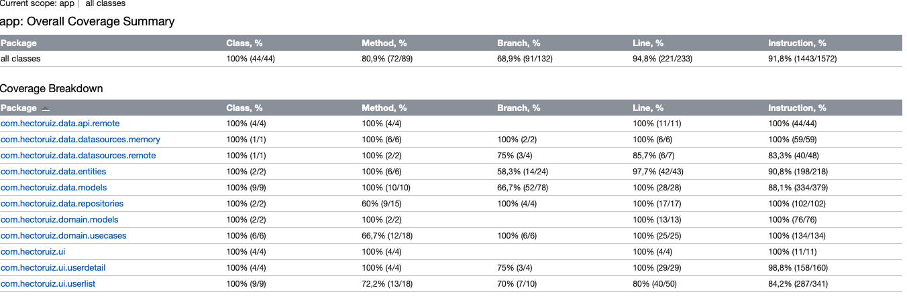

# Random Users Challenge

## Features

The app consists in a list-detail screen to show a list of users and its detail. The app allows to
request more users once the scroll's list arrives at the end of the list.
Moreover it's possible to filter the list by name, surname or the email of any user. Also delete any
user is an other feature. These two functionalities work together: while you have some users
filtered you can delete any user or you can delete one of them and filter it and it won't appear.
The order of the users is always the same even killing the app or asking for more users.

* The app works in Light and Dark Mode.
* It holds the information and show the proper one even the device changes to portrait orientation
  to landscape or in the opposite way.
* Have been added some animations to make the app more attractive:
    - Animation when any user is added or removed from the list.
    - The More Users's button its shows or its hided with an animation.
    - The transitions from the list to any user detail or in the opposite way shows an animation
      too.

## Architecture

The app was modularizated by the layers how is defined the Clean Architecture.
Through this [guideline](https://developer.android.com/topic/architecture) it suggests to separate
the concern of responsibilities of the classes in any project following this principle. The project
contains the modules according the layers specified in the documentation:

* app
  * di: Contains how the instances might be instantiated.
  * navigation: Keep the class whose define the transitions between screens.
  * ui: To hold Android UI elements needed as a starting point of the app.
* data
    * api: Definition of the remote and local sources to be able to communicate with both.
    * datasources: Elements whom start the connection to recover the data from the remote and local
      sources.
    * entities: Class to hold the data from the DDBB.
    * models: Class to hold the data from the remote server.
    * repositories: Contracts of the datasource to interact with the use cases and the repository,
      responsible's class to obtain the data from the proper datasource in every scenario.
* domain
    * commons: To store classes used by many classes.
    * models: Data classes to hold the data between the domain layer to the ui layer.
    * repositories: Contracts of the repositories to interact with the use cases.
    * usecases: Classes to interact with the repositories and transform the data to the ui layer.
* ui
    * theme: Where is defined the information in how looks the app.
    * userlist: For managing the user list screen with its composables, its view model and its ui
      state.
    * userdetail: For managing the user detail screen with its composables, its view model and its ui
      state.

## Third-party libraries

To develop the app it have used the following third-party libraries:

* Coroutines: To obtain the data from the server and for other asynchronous requests.
* Room: All the users obtained from the server are stored in a DDBB to interact with it and show,
  add, delete and filter the users.
* Flow: To use reactive programming,
* Jetpack Compose: All the interfaces and UI elements are done with it.
* Retrofit: Used to define the network API.
* Coil: To load asynchronously remote images
* OkHttp: To define the HttpClient to handle the server request.
* Hilt: Needed to make simpler the instance creation and the relationship between different classes.
* Navigation compose: Handle the navigation from the list to the user's detail.
* Kotlin Serialization: To manage the data between different elements and the
  serialization/deserialization of the data from all the sources.
* Ksp: Annotations processor quicker than Kapt.
* JUnit: To determine the asserts between objects in testing.
* Mockk: To fake instances and used them in testing.
* Turbine: Making easier to test flows.

## Testing

### Kover

In the project it have configuration the Kover tool to calculate the test coverage. Thanks two
gradle tasks, Kover allow us to set the minimum coverage accepted and to generate an inform with the
test coverage.

* *./gradlew :app:koverHtmlReport*
* *./gradlew koverVerify*

This tool doesn't count the instrumented test in the coverage, just counts the unit tests. For this
reason its have added some rules in the app:buildGradle to exclude all the files which are not
possible to test with unit testing.
The following image shows the testing coverage's app:

## Instrumented tests

Some instrumented tests cover some classes which they aren't possible to test using unit tests. It
have tested:

* Navigation Compose: Some tests were added to check the app's navigation.
* Jetpack Compose: Almost all the composables were tested.
* Room: Some tests were added to check the app's DDBB.